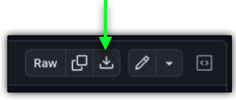
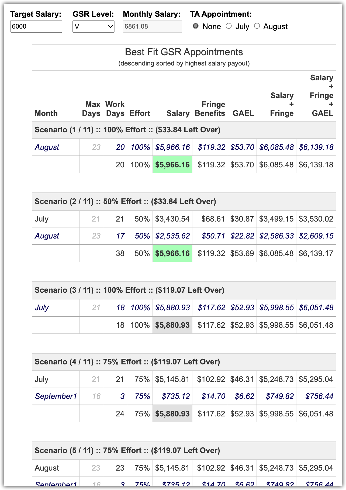

# Summer GSR Scenarios

- Helper app to calculate plausible summer GSR appointments to maximize payout to student for a given pool of money.

## Download
- Unix
   - ```sh
         wget https://raw.githubusercontent.com/bschulth/for_clara/main/GSR/summer_gsr.R
     ```
    
- Windows
   - Navigate to https://github.com/bschulth/for_clara/blob/main/GSR/summer_gsr.R
   - Click the `download` icon
      - 

## Run From Command Line
- Unix
   - Make sure `R` is installed (tested on R-4.3.0):
      - https://cran.r-project.org/bin/linux/
   
   - ```sh
     # chmod 700 summer_gsr.R
     ./summer_gsr.R
     
     # or maybe
     Rscript --vanilla summer_gsr.R
     ```
     
- Windows
   - Make sure `R` is installed (tested on R-4.3.0):
      - https://cran.r-project.org/bin/windows/base/R-4.3.0-win.exe
      
   - ```sh
         # If R is on path:
         Rscript summer_gsr.R
         
         # If R is not on path, then maybe something like:
         %LOCALAPPDATA%\Programs\R\R-4.3.0\bin\x64\Rscript --vanilla summer_gsr.R
     ```

## Example View


